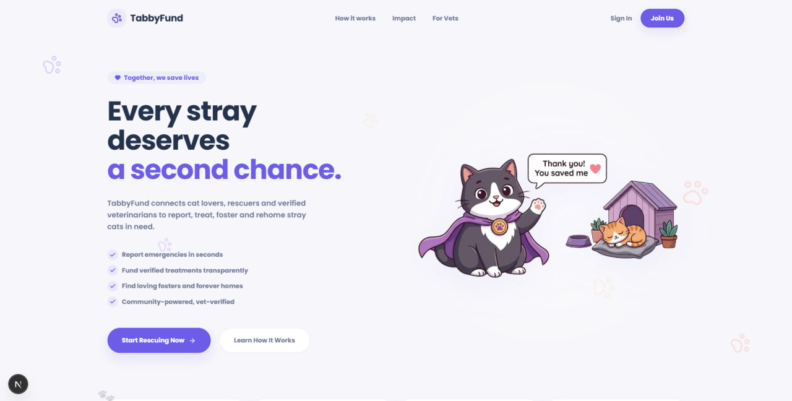
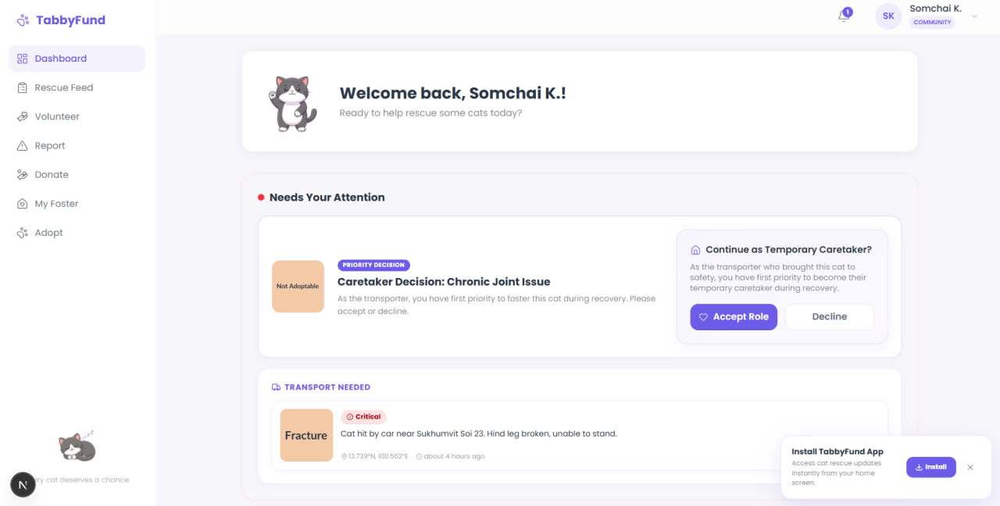
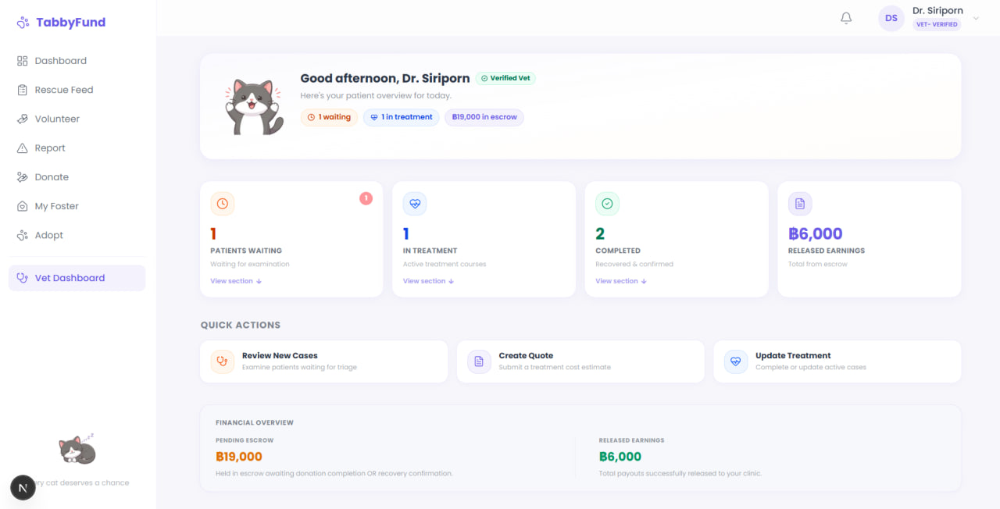
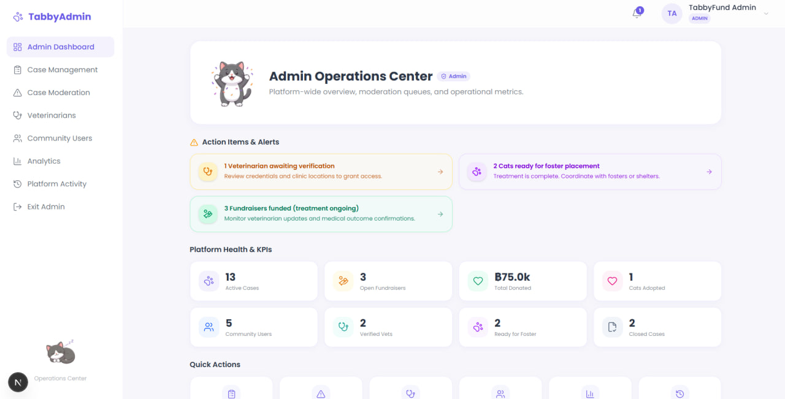
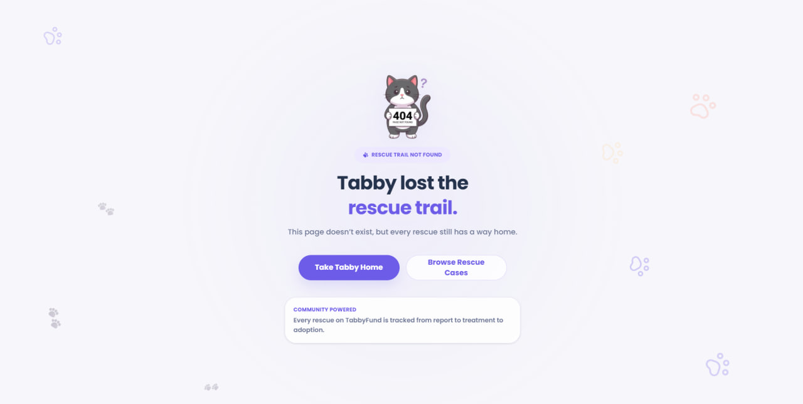
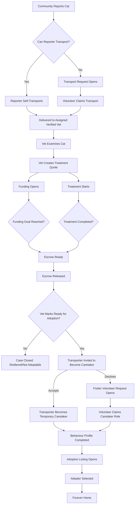

# TabbyFund


TabbyFund is a mobile-first progressive web app for managing the full rescue lifecycle of stray cats — from community reporting and volunteer transport to verified vet treatment, simulated escrow funding, temporary foster care, and adoption. Built with Next.js and Supabase to demonstrate a closed-loop rescue workflow.

---

## Table of Contents

- [Preview](#preview)
- [Problem](#problem)
- [Inspiration](#inspiration)
- [Hackathon Theme](#hackathon-theme)
- [Solution](#solution)
- [Rescue Workflow](#rescue-workflow)
- [Key Features](#key-features)
- [User Roles](#user-roles)
- [Tech Stack](#tech-stack)
- [Live Demo](#🚀-live-demo)
- [Prerequisites](#prerequisites)
- [Installation](#installation)
- [Environment Variables](#environment-variables)
- [Database Setup](#database-setup)
- [Running Locally](#running-locally)
- [Demo Accounts](#demo-accounts)
- [Recommended Demo Flow](#recommended-demo-flow)
- [Admin / Vet Approval Flow](#admin--vet-approval-flow)
- [Security](#security)
- [MVP Limitations](#mvp-limitations)
- [Project Structure](#project-structure)
- [Testing](#testing)
- [Deployment](#deployment)
- [License](#license)

---

## Preview

<p align="center">
  
</p>

<p align="center">
  <em>TabbyFund — connecting every rescue from report to forever home.</em>
</p>

---

<table>
  <tr>
    <td>
      
      <br>
      <strong>Community Dashboard</strong>
    </td>
    <td>
      
      <br>
      <strong>Vet Dashboard</strong>
    </td>
  </tr>
  <tr>
    <td>
      
      <br>
      <strong>Admin Dashboard</strong>
    </td>
    <td>
      
      <br>
      <strong>404 Page</strong>
    </td>
  </tr>
</table>

---

## Problem

Stray cat rescue often breaks down because reporting, transport, vet treatment, fundraising, fostering, and adoption are handled separately across disconnected channels. Rescued cats fall through the cracks when no single system tracks their journey from discovery to permanent home.

## Inspiration

In places like Thailand, stray cats are common and rescue efforts are often handled informally — through social media posts, personal contacts, and scattered donation requests. Many people want to help, but the process from finding an injured cat to arranging transport, getting a vet quote, funding treatment, organizing temporary care, and finding a permanent adopter is confusing and fragmented. TabbyFund was created to turn that messy rescue journey into one clear, trackable workflow that anyone can participate in.

## Hackathon Theme

TabbyFund was built for a cat-themed hackathon with a focus on **real-world impact** over entertainment. Rather than building a game or novelty app, this project addresses a genuine problem faced by communities with large stray cat populations. Every feature was designed to mirror how real rescue coordination works — just digitized, transparent, and trackable.

## Solution

TabbyFund provides a single platform connecting the entire rescue chain. Every participant uses the same app with role-appropriate views.

## Rescue Workflow



`Reported → Transport → Vet → Quote → Funding → Treatment → Foster → Adoption → Forever Home`

---

## Key Features

### Community Features

- **Rescue Reporting:** Multi-step wizard with photo upload, AI analysis, location picker, and transport preference
- **Volunteer Transport:** Self-transport option or leave cases open for community volunteers to claim
- **Simulated Donations:** Escrow-based funding released only after the quote is fully funded and vet treatment is completed
- **Temporary Caretaker:** Volunteer to foster recovered cats and complete behavioural profiles
- **Adoption Discovery:** Browse publicly adoptable cats with personality, health, and home match info

### Vet Features

- **Treatment Quotes:** Line-item quote builder with automatic funding goal creation
- **Treatment Management:** Start, update, and complete treatment records
- **Adoption Approval:** Medical clearance and readiness checkbox before adoption eligibility
- **Case Triage:** View assigned cases by status (waiting, quoted, in-treatment, completed)

### Admin Features

- **Vet Verification:** Approve or reject pending vet applications with clinic info and geocoding status
- **Case Moderation:** Triage queue for flagged and new rescue reports with AI confidence indicators
- **User Management:** View community members, suspend accounts, manage roles
- **Platform Analytics:** Real-time stats from database (cases, funding, users, vets)

### AI and Automation

- **Gemini Vision Triage:** Real Google Gemini API analyzes rescue photos for condition, severity, and first-aid guidance
- **Graceful Fallback:** If AI is unavailable, the app continues with a fallback assessment — never blocks the user
- **Caretaker Handoff:** Transporter is invited to become temporary caretaker after recovery; if declined, a foster volunteer request opens
- **Auto-Fund Transition:** Case automatically advances to FUNDED when donations reach the quote goal

### PWA and Platform

- **Installable:** Web App Manifest and Service Worker for mobile home screen installation
- **Offline Page:** Friendly offline screen when network is unavailable
- **Responsive:** Mobile-first design with desktop sidebar layout
- **Notifications:** In-app notification system with unread badges and dropdown preview

---

## User Roles

| Role          | Description                                                                                                                                                                           |
| ------------- | ------------------------------------------------------------------------------------------------------------------------------------------------------------------------------------- |
| **Community** | Reports cats, volunteers to transport, donates, fosters, adopts. All functional responsibilities (reporter, transporter, donor, caretaker, adopter) are performed by community users. |
| **Vet**       | Creates treatment quotes, manages assigned cases, confirms treatment outcomes. Requires admin verification.                                                                           |
| **Admin**     | Approves/rejects vet applications, moderates cases, manages users, views platform analytics.                                                                                          |

There are only three database roles. Transporter, donor, foster, and adopter are **responsibilities** — not separate account types.

## Tech Stack

| Layer             | Technology                                                 |
| ----------------- | ---------------------------------------------------------- |
| Framework         | Next.js 16 (App Router, Server Components, Server Actions) |
| Language          | TypeScript 5                                               |
| Styling           | Tailwind CSS 4, Radix UI, shadcn/ui                        |
| Auth and Database | Supabase (Auth, PostgreSQL, RLS, Storage)                  |
| AI                | Google Gemini Vision (cat condition triage)                |
| Maps              | Leaflet / React-Leaflet                                    |
| Geocoding         | Geoapify (server-side)                                     |
| Forms             | React Hook Form + Zod                                      |
| Charts            | Recharts                                                   |
| PWA               | Service Worker + Web App Manifest                          |

---

## 🚀 Live Demo

Website:
[TabbyFund](https://tabbyfund.vercel.app/)

Video Demonstration:
[TabbyFund Video](https://drive.google.com/file/d/1w9e5_1NfSIIAUfYhr56Fc1cV_peETZM6/view?usp=drive_link)

---

## Prerequisites

- **Node.js** 20 or later
- **npm** (comes with Node.js)
- **Git**
- **Supabase project** (cloud or local)
- Modern browser (Chrome, Firefox, Safari, Edge)

Optional (only for local Supabase):

- Docker Desktop
- Supabase CLI (`npm install -g supabase`)

## Installation

```bash
git clone https://github.com/KoVoidG/tabbyfund.git
cd tabbyfund
npm install
cp .env.example .env.local
```

After copying `.env.example` to `.env.local`, review the included environment variables.

## Environment Variables

| Variable                        | Scope       | Description                           | Source                                     |
| ------------------------------- | ----------- | ------------------------------------- | ------------------------------------------ |
| `NEXT_PUBLIC_SUPABASE_URL`      | Public      | Supabase project URL                  | Dashboard → Settings → API                 |
| `NEXT_PUBLIC_SUPABASE_ANON_KEY` | Public      | Supabase anonymous key (respects RLS) | Dashboard → Settings → API                 |
| `SUPABASE_SERVICE_ROLE_KEY`     | Server-only | Bypasses RLS for system writes        | Dashboard → Settings → API                 |
| `GEMINI_API_KEY`                | Server-only | Google Gemini for AI photo triage     | [Google AI Studio](https://ai.google.dev/) |
| `GEOAPIFY_API_KEY`              | Server-only | Geocoding for vet clinic locations    | [geoapify.com](https://www.geoapify.com/)  |
| `NEXT_PUBLIC_SITE_URL`          | Public      | Site URL for password reset links     | Your deployment URL                        |

### Environment Variables for Judging

`.env.example` lists the required environment variables for local setup.

API keys are not committed publicly. Judges can use the deployed Vercel demo with the provided demo accounts, or create their own Supabase, Gemini, and Geoapify keys when running locally.

No Supabase service role key, database password, or privileged admin secret is included.

⚠️ **Security:**

- `SUPABASE_SERVICE_ROLE_KEY` must NEVER be exposed in client code or prefixed with `NEXT_PUBLIC_`.
- `GEMINI_API_KEY` and `GEOAPIFY_API_KEY` are server-only — they run exclusively in Server Actions.
- Never commit `.env.local` with real secrets.

**Graceful fallback:** If `GEMINI_API_KEY` is not configured, the rescue report wizard uses a fallback assessment instead of failing. If `GEOAPIFY_API_KEY` is missing, vet clinic coordinates are saved as null and transport distance is shown as "unavailable."

## Database Setup

The project uses 18 Supabase migrations in `supabase/migrations/`. The files are numbered up to 019 because one number is skipped.

### Option A: Supabase CLI

```bash
supabase link --project-ref <your-project-ref>
supabase db push
```

### Option B: Manual via Dashboard

1. Open Supabase Dashboard → SQL Editor
2. Run each file in `supabase/migrations/` in filename order (001 → 019)
3. After migrations, run `supabase/seed_cloud_demo.sql` for demo data

### Demo Seed

`supabase/seed_cloud_demo.sql` populates 15 rescue cases at various lifecycle stages. It requires auth users to be created first (see Demo Accounts).

## Running Locally

```bash
npm run dev
```

Open [http://localhost:3000](http://localhost:3000)

| Script              | Description                          |
| ------------------- | ------------------------------------ |
| `npm run dev`       | Start development server             |
| `npm run build`     | Production build                     |
| `npm run start`     | Start production server              |
| `npm run lint`      | Run ESLint                           |
| `npm run test:e2e`  | Run Playwright smoke tests           |
| `npm run gen:types` | Regenerate Supabase TypeScript types |
| `npm run db:push`   | Push migrations to Supabase          |

## Demo Accounts

Create these users in Supabase Dashboard → Authentication → Users (check "Auto Confirm"):

| Role         | Email                   | Password    | Purpose                                  |
| ------------ | ----------------------- | ----------- | ---------------------------------------- |
| Community    | somchai@example.com     | password123 | Report, transport, donate, foster, adopt |
| Community    | nattaya@example.com     | password123 | Report, donate                           |
| Community    | prawit@example.com      | password123 | Transport volunteer, temporary caretaker |
| Community    | kannika@example.com     | password123 | Reporter, donor, adopter                 |
| Community    | thana@example.com       | password123 | Reporter, donor                          |
| Verified Vet | dr.siriporn@example.com | password123 | Create quotes, manage treatment          |
| Verified Vet | dr.anuwat@example.com   | password123 | Create quotes, manage treatment          |
| Pending Vet  | dr.newvet@example.com   | password123 | Test vet verification flow               |
| Admin        | admin@tabbyfund.com     | password123 | Approve vets, moderate cases, analytics  |

After creating auth users, run `seed_cloud_demo.sql` to set up profiles and demo cases.

> [!WARNING]
> These are demo-only credentials for the seeded hackathon environment. Do not use these credentials in production.

## Recommended Demo Flow

1. **Sign in as community** (somchai@example.com) → `/dashboard`
2. **Report a rescue** → `/report` → upload photo → AI analyzes condition → set location → check "I can transport" → submit
3. **View the case** → `/cases/[id]` → see AI triage, transport card, nearest vet clinics
4. **Mark as delivered** → TransportCard → "Mark Delivered to Vet"
5. **Sign in as vet** (dr.siriporn@example.com) → `/vet`
6. **Create a quote** → `/vet/cases/[id]` → QuoteBuilder → submit → case opens for funding
7. **Sign in as community** → `/donate` → select case → donate full amount
8. **Vet starts treatment** → `/vet/cases/[id]` → create treatment record
9. **Vet completes treatment** → CompletionCard → Recovered + Approve for Adoption
10. **Caretaker handoff** → transporter accepts, or declines so another community volunteer can claim → `/foster` → complete behavioural profile
11. **Cat appears on** `/adopt` → all three conditions met
12. **Adopt the cat** → celebration screen with "Rescue More Cats" prompt
13. **Sign in as admin** → `/admin` → approve/reject pending vets, moderate cases, view analytics

### Pre-Seeded Cases for Quick Testing

| Case | Status                    | What to Test           |
| ---- | ------------------------- | ---------------------- |
| 1    | AWAITING_TRANSPORT        | Claim transport        |
| 3    | AT_VET (no quote)         | Vet creates quote      |
| 4–6  | FUNDING_OPEN              | Donate                 |
| 7    | IN_TREATMENT              | Complete treatment     |
| 9    | IN_FOSTER (adoptable)     | View on /adopt         |
| 13   | TREATED (needs caretaker) | Volunteer as caretaker |
| 15   | DECEASED                  | Terminal case display  |

## Admin / Vet Approval Flow

1. User registers and selects "Veterinarian" role (provides clinic name and address)
2. Clinic address is geocoded via Geoapify (graceful null if unavailable)
3. Account is created with `is_verified = false`
4. Vet sees pending verification screen at `/vet`
5. Admin visits `/admin/vets` → sees clinic info and geocoding status → clicks Approve or Reject
6. **Approved:** Vet immediately gains access to vet tools
7. **Rejected:** Rejected vets see a rejection screen explaining that their registration was not approved. They can choose to continue as a community member or sign out.

---

## Security

- **Supabase RLS** protects database access.
- **Server-side route guards** protect role-specific routes.
- **Server Actions** validate sensitive operations.
- **Service role** is server-only and only used for protected system operations.
- **Exact rescue locations** are not exposed through public/shared case descriptions.
- **Password reset and registration flows** avoid explicit email-existence disclosure in public-facing error messages.
- **Aikido Security scan** issues were fixed and retested successfully.

For full details, see [documentation/Security_Report.md](documentation/Security_Report.md).

## MVP Limitations

- **Payments are simulated** — no real payment provider. Donations are stored with HELD_IN_ESCROW status.
- **Geocoding depends on API quota** — clinic coordinates may be null if Geoapify is unavailable.
- **Admin analytics charts** use placeholder visualization data for chart components.
- **Location picker** uses a demo GPS location in the report wizard.
- **Notifications** are created by server actions during workflow events. No real-time push or WebSocket.
- **Adoption application** is not formally persisted (no applications table in schema).
- This is a hackathon MVP — production deployment would require additional hardening.

---

## Project Structure

```
src/
├── app/                  # Next.js App Router
│   ├── (app)/            # Authenticated routes (dashboard, cases, vet, admin, etc.)
│   ├── (auth)/           # Public auth routes (login, register, forgot/reset password)
│   └── auth/callback/    # Supabase auth callback handler
├── components/           # Reusable UI (shell, branding, shadcn/ui)
├── features/             # Feature modules (admin, adoption, auth, cases, donation, etc.)
├── lib/                  # Server helpers (supabase, queries, geocode, gemini)
└── types/                # TypeScript types (database.ts)

supabase/
├── migrations/           # 18 SQL migration files
├── seed_cloud_demo.sql   # Cloud-safe demo seed (15 cases)
└── config.toml           # Supabase project config

public/
├── manifest.json         # PWA manifest
├── sw.js                 # Service worker
└── mascot/               # TabbyFund cat mascot assets

documentation/
├── Project_Report.md    # Full project report
├── Testing_Report.md     # Full testing documentation
└── Security_Report.md    # Security scan & remediation report
```

## Testing

Manual testing was completed on localhost throughout development. Playwright smoke tests are available.

For full testing details, see [documentation/Testing_Report.md](documentation/Testing_Report.md).

```bash
npm run test:e2e        # Run Playwright smoke tests
npm run test:e2e:ui     # Run with interactive UI
```

## Deployment

### Vercel (Recommended)

1. Connect repository to Vercel
2. Add all environment variables in Project Settings → Environment Variables
3. Ensure Supabase migrations are applied to your cloud project
4. Deploy — Vercel auto-detects Next.js
5. Update `NEXT_PUBLIC_SITE_URL` to your production domain

Never expose `SUPABASE_SERVICE_ROLE_KEY` in build logs or client bundles.

---

## License

This project is licensed under the MIT License. See the [LICENSE](LICENSE) file for details.

---

<p align="center">
  Built with 💜 for cats everywhere
</p>
