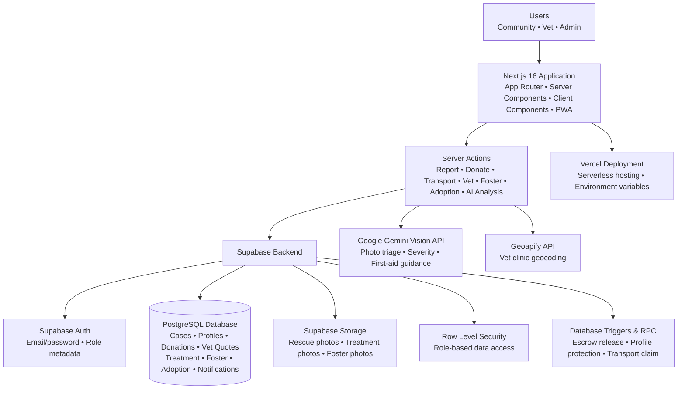
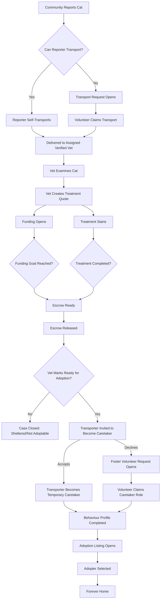

# HackTheKitty 2026 Project Report

**Project Name:** TabbyFund  
**Reference ID:** 3DH2EH7W

## Submission Links

- **Live App:** [https://tabbyfund.vercel.app/](https://tabbyfund.vercel.app/)
- **GitHub Repository:** [KoVoidG/tabbyfund](https://github.com/KoVoidG/tabbyfund)
- **Demo Video:** [Google Drive Link](https://drive.google.com/file/d/1w9e5_1NfSIIAUfYhr56Fc1cV_peETZM6/view?usp=drive_link)
- **Security Report:** [Security_Report.md](Security_Report.md)
- **Testing Report:** [Testing_Report.md](Testing_Report.md)

## 1. Executive Summary

TabbyFund is a mobile-first Progressive Web App (PWA) that streamlines and digitizes the complete rescue journey of stray cats, from community reporting and volunteer transport to verified veterinary treatment, transparent escrow-based fundraising, temporary foster care, and adoption. By bringing every participant into a single platform, TabbyFund helps reduce the communication gaps that often cause rescue cases to stall, making the entire process more coordinated, transparent, and accessible for communities.

During development, the application was designed as an MVP with production-oriented practices including role-based access control, Row Level Security, server-side validation, Progressive Web App support, and AI-assisted rescue assessment.

---

## 2. Project Overview

### 2a. Why you're building what you're building

While researching animal welfare in Thailand, I came across numerous news articles and community rescue stories describing the same recurring problem. Many people genuinely want to help injured stray cats, but rescuing an animal often becomes financially overwhelming once veterinary treatment is required. Community members may be able to provide temporary care, transport the animal, or donate small amounts, but there is no single platform that connects everyone involved in the rescue process.

Instead, rescue efforts are usually coordinated across disconnected channels such as Facebook posts, LINE chats, personal messages, and donation requests. Important information is easily lost, responsibilities become unclear, fundraising lacks transparency, and rescued animals may never progress beyond treatment because there is no structured workflow for fostering or adoption.

TabbyFund was created to solve this fragmentation by providing one unified platform that manages the entire rescue lifecycle. Rather than focusing only on donations or only on adoption, the platform connects reporting, transportation, veterinary treatment, fundraising, temporary care, and adoption into one continuous workflow, ensuring that every rescued cat has a clearer path toward finding a permanent home.

### 2b. How it relates to the theme

The HackTheKitty 2026 theme encourages projects that create meaningful impact for cats. TabbyFund directly aligns with this objective by addressing real-world challenges faced by stray cat rescue communities instead of focusing on entertainment or novelty.

Every major feature of the application is designed around improving the welfare of rescued cats. Community members can report injured cats, volunteers can transport them safely to verified veterinary clinics, veterinarians can publish transparent treatment quotations, donors can collectively fund medical expenses through an escrow-based workflow, temporary caretakers can prepare recovered cats for adoption, and adopters can provide them with permanent homes.

The project demonstrates how technology can coordinate an entire rescue ecosystem, helping communities work together more effectively while improving outcomes for stray cats.

### 2c. Target Audience

TabbyFund is designed for communities involved in stray cat rescue, particularly in areas where rescue efforts are coordinated informally.

Its primary users include:

- Community members who discover injured stray cats and want to report emergencies.
- Volunteers who can transport rescued cats to veterinary clinics.
- Verified veterinarians who assess injuries, provide treatment quotations, and update recovery progress.
- Donors who want transparency regarding how medical funds are used.
- Temporary caretakers who foster recovered cats until adoption.
- Adopters looking to provide rescued cats with permanent homes.
- Platform administrators responsible for verifying veterinarians and moderating rescue cases.

Although inspired by real rescue challenges in Thailand, the workflow is designed to be adaptable to community rescue organizations in many regions.

---

## 3. Key Features

| Category   | Feature                      | Description                                                                                                                      |
| ---------- | ---------------------------- | -------------------------------------------------------------------------------------------------------------------------------- |
| Community  | Rescue Reporting             | Multi-step wizard: photo upload → AI triage → location → details → transport preference                                          |
| Community  | Volunteer Transport          | Claim open transport missions or self-transport as reporter                                                                      |
| Community  | Escrow-based Donation System | Currently simulated for the MVP                                                                                                  |
| Community  | Temporary Caretaker          | Volunteer to foster recovered cats and complete behavioural profiles                                                             |
| Community  | Adoption Discovery           | Browse adoptable cats (visible only when all conditions met)                                                                     |
| Vet        | Treatment Quotes             | Line-item quote builder creating funding goals                                                                                   |
| Vet        | Treatment Management         | Start, update, complete treatment with outcome recording                                                                         |
| Vet        | Adoption Approval            | Medical clearance checkbox before adoption eligibility                                                                           |
| Admin      | Vet Verification             | Approve/reject pending vet applications with clinic geocoding status                                                             |
| Admin      | Case Moderation              | Triage queue with AI confidence indicators                                                                                       |
| Admin      | User Management              | View, suspend, manage community/vet/admin profiles                                                                               |
| AI         | Gemini Vision Triage         | Server-side photo analysis for condition/severity/first-aid                                                                      |
| AI         | Graceful Fallback            | Fallback assessment if API is unavailable                                                                                        |
| Automation | Caretaker Handoff            | Transporter is invited to become caretaker after recovery; if declined, another community volunteer can claim the caretaker role |
| Automation | Auto-Fund Transition         | Case advances to FUNDED when donations reach quote goal                                                                          |
| Platform   | PWA                          | Installable with service worker and offline page                                                                                 |
| Platform   | Notifications                | In-app notification system with unread badges                                                                                    |
| Platform   | Rejected Vet Handling        | Clear rejection screen with community continuation option                                                                        |
| Platform   | Adoption Celebration         | Success screen with "Rescue More Cats" prompt                                                                                    |

---

## 4. Technology Stack

| Layer                   | Technology                           | Purpose                                                                                                    |
| ----------------------- | ------------------------------------ | ---------------------------------------------------------------------------------------------------------- |
| Frontend Framework      | Next.js 16 (App Router)              | Builds the application using Server Components, Client Components, Server Actions, and file-based routing. |
| Programming Language    | TypeScript 5                         | Provides static type safety and improves maintainability across the application.                           |
| UI & Styling            | Tailwind CSS 4                       | Utility-first CSS framework for responsive, mobile-first design.                                           |
| UI Components           | shadcn/ui + Radix UI                 | Accessible, reusable, and consistent user interface components.                                            |
| Forms & Validation      | React Hook Form + Zod                | Form management and runtime validation for user input.                                                     |
| Backend Platform        | Supabase                             | Backend-as-a-Service providing authentication, PostgreSQL database, storage, and realtime capabilities.    |
| Authentication          | Supabase Auth                        | Secure email/password authentication with role-based access control.                                       |
| Database                | PostgreSQL (Supabase)                | Stores rescue cases, user profiles, donations, treatment records, foster records, and adoption data.       |
| Database Security       | Supabase Row Level Security (RLS)    | Enforces secure database access policies directly at the data layer.                                       |
| File Storage            | Supabase Storage                     | Stores rescue photos, treatment images, and foster documentation securely.                                 |
| Artificial Intelligence | Google Gemini Vision API             | Analyses rescue photos to generate preliminary condition assessments and first-aid guidance.               |
| Maps & Geolocation      | Leaflet, React Leaflet, Geoapify API | Displays rescue locations, veterinary clinics, and performs address geocoding.                             |
| Data Visualization      | Recharts                             | Visualises platform statistics and dashboard analytics.                                                    |
| Progressive Web App     | Service Worker + Web App Manifest    | Enables installation, offline support, and an app-like experience across devices.                          |
| Testing                 | Playwright                           | Performs end-to-end testing of critical user workflows.                                                    |
| Deployment              | Vercel                               | Hosts and deploys the production-ready application.                                                        |
| Version Control         | Git & GitHub                         | Source code management, version tracking, and collaboration.                                               |

---

## 5. Technical Architecture

### System Overview

TabbyFund follows a modern serverless architecture built on **Next.js 16** and **Supabase**, with all application logic centred around a complete rescue workflow. The frontend communicates with secure Server Actions, which interact with Supabase Authentication, PostgreSQL, Storage, and external services such as Google Gemini and Geoapify.

The application is organised into three primary user roles:

- **Community** – Reports rescues, transports cats, donates, fosters, and adopts.
- **Veterinarian** – Creates quotations, manages treatments, and approves cats for adoption.
- **Administrator** – Verifies veterinarians, moderates rescue cases, and manages the platform.

All business operations are performed through secure server-side actions, while database access is protected using Supabase Row Level Security (RLS).

---

### High-Level Request Flow

```
Community / Vet / Admin
            │
            ▼
     Next.js App Router
            │
            ▼
     Server Actions
            │
            ├──────────────► Google Gemini Vision API
            │                      │
            │                      ▼
            │              AI Condition Analysis
            │
            ├──────────────► Geoapify API
            │                      │
            │                      ▼
            │             Clinic Geocoding
            │
            ▼
       Supabase Backend
     ├── Authentication
     ├── PostgreSQL Database
     ├── Row Level Security
     └── Storage
            │
            ▼
      Updated Rescue Workflow
```

---

### Authentication & Authorization

Authentication is handled through **Supabase Auth** using email and password.

When a new account is created, a database trigger automatically creates the corresponding profile and assigns the selected role.

Server-side route guards ensure that users can only access pages appropriate to their role:

- Community → Community Dashboard
- Verified Veterinarian → Vet Portal
- Pending Veterinarian → Verification Pending
- Administrator → Admin Operations Centre

Sensitive actions are additionally protected by Supabase Row Level Security and server-side validation.

---

### Rescue Workflow

The entire platform revolves around a structured rescue lifecycle.

```
Reported
      ↓
Transport Accepted
      ↓
Delivered to Verified Vet
      ↓
Treatment Quote
      ↓
Community Funding
      ↓
Treatment
      ↓
Temporary Care
      ↓
Behaviour Profile
      ↓
Adoption Listing
      ↓
Forever Home
```

Each stage updates the database through secure Server Actions, ensuring users cannot skip required workflow steps.

---

### Artificial Intelligence

TabbyFund integrates the **Google Gemini Vision API** to assist with initial rescue assessment.

When a rescue photo is uploaded:

1. The image is stored securely in Supabase Storage.
2. A Server Action retrieves the image.
3. Google Gemini analyses the photo.
4. The AI returns:
   - suspected condition
   - severity
   - confidence score
   - reasoning
   - first-aid advice
   - estimated recovery
5. The assessment is stored alongside the rescue case.

If AI is unavailable, the application automatically falls back to a generic assessment so users can continue reporting without interruption.

---

### Database Security

Supabase PostgreSQL stores all application data including rescue cases, veterinary records, donations, foster records, adoption listings, and notifications.

Security is enforced through multiple layers:

- Supabase Authentication
- Row Level Security (RLS)
- Database triggers
- Server-side validation
- Role-based route guards
- Service-role operations for protected system transitions

This defence-in-depth approach ensures users can only access or modify information they are authorised to manage.

---

### Donation Workflow

Community donations are first held in escrow.

Once the fundraising goal is reached and the veterinarian confirms treatment completion, the system automatically releases the escrowed funds and advances the rescue workflow to the next stage.

This ensures transparency between donors, veterinarians, and rescue volunteers.

---

### Adoption Workflow

Cats become publicly adoptable only after three conditions are satisfied:

- Veterinary treatment has been completed and approved for adoption.
- The temporary caretaker has completed the behavioural profile.
- An active adoption listing has been created.

This prevents incomplete or unsuitable cases from appearing in the adoption feed.

---

### System Architecture (Technical)



### Rescue Workflow



---

## 6. Testing Matrix

| Feature / Flow            | Steps                                            | Expected Result                                              | Actual Result                       | Status  |
| ------------------------- | ------------------------------------------------ | ------------------------------------------------------------ | ----------------------------------- | ------- |
| Community Registration    | Register with email, select Community role       | Account created, redirected to /dashboard                    | Works as expected                   | ✅ Pass |
| Vet Registration          | Register with Vet role, add clinic info          | Account created, clinic geocoded, redirected to /vet pending | Works as expected                   | ✅ Pass |
| Login (Community)         | Enter community credentials, submit              | Redirect to /dashboard with personal stats                   | Works as expected                   | ✅ Pass |
| Login (Vet)               | Enter verified vet credentials                   | Redirect to /vet with case dashboard                         | Works as expected                   | ✅ Pass |
| Login (Admin)             | Enter admin credentials                          | Redirect to /admin with platform stats                       | Works as expected                   | ✅ Pass |
| Report Rescue             | Complete 5-step wizard with photo                | Case created, photo uploaded, transport request created      | Works as expected                   | ✅ Pass |
| AI Photo Analysis         | Upload cat photo in report wizard                | Gemini returns condition/severity/first-aid                  | Works (fallback if API unavailable) | ✅ Pass |
| Self-Transport            | Check "I can transport" in report                | Case = IN_TRANSIT, reporter = transporter                    | Works as expected                   | ✅ Pass |
| Volunteer Transport Claim | Click "Volunteer to Transport" on open case      | Transport CLAIMED, case IN_TRANSIT                           | Works as expected                   | ✅ Pass |
| Mark Delivered            | Transporter clicks "Mark Delivered to Vet"       | Transport DELIVERED, case AT_VET                             | Works as expected                   | ✅ Pass |
| Vet Quote Creation        | Fill quote builder, submit                       | Quote created, case advances to FUNDING_OPEN                 | Works as expected                   | ✅ Pass |
| Donation                  | Select amount, confirm payment                   | Donation row created (HELD_IN_ESCROW)                        | Works as expected                   | ✅ Pass |
| Full Funding              | Donate enough to meet quote goal                 | Case auto-advances to FUNDED                                 | Works as expected                   | ✅ Pass |
| Treatment Completion      | Vet marks RECOVERED + approve adoption           | Case TREATED, adoption listing created, caretaker assigned   | Works as expected                   | ✅ Pass |
| Behavioural Profile       | Caretaker fills personality form, marks complete | `behaviour_profile_complete = true`                          | Works as expected                   | ✅ Pass |
| Adoption Visibility       | All 3 conditions met                             | Cat appears on /adopt page                                   | Works as expected                   | ✅ Pass |
| Adoption Success          | Complete adoption flow                           | Celebration screen with "Rescue More Cats"                   | Works as expected                   | ✅ Pass |
| Admin Vet Approval        | Admin clicks Approve on pending vet              | `is_verified = true`, vet gains access                       | Works as expected                   | ✅ Pass |
| Admin Vet Rejection       | Admin clicks Reject                              | Role downgraded to community, rejection screen shown         | Works as expected                   | ✅ Pass |
| RLS: Community → /admin   | Community user navigates to /admin               | Redirected to /dashboard                                     | Works as expected                   | ✅ Pass |
| RLS: Community → /vet     | Community user navigates to /vet                 | Redirected to /dashboard                                     | Works as expected                   | ✅ Pass |
| Password Reset            | Request reset, receive email, set new password   | Password updated, redirected to login                        | Works as expected                   | ✅ Pass |
| PWA Installation          | Open in mobile Chrome, install prompt            | App installs to home screen                                  | Works as expected                   | ✅ Pass |
| Responsive Layout         | View on mobile/tablet/desktop                    | Layout adapts (sidebar on desktop, bottom nav on mobile)     | Works as expected                   | ✅ Pass |
| Notifications             | Perform actions, check bell dropdown             | Unread count updates, dropdown shows recent                  | Works as expected                   | ✅ Pass |

## 7. Security Review

TabbyFund was scanned with Aikido Security before submission. The scan identified issues related to access control, sensitive data exposure, input validation, open redirects, business logic bypasses, and unsafe external image loading. These issues were fixed and retested successfully. The Security Report contains screenshots of the scan results and a summary of the remediations.

For registration security, duplicate-email signup attempts no longer display a specific "account already exists" error; the register action follows the same initial post-registration redirect path and relies on the normal authentication guard afterward.

---

## 8. Future Improvements

| Priority | Improvement                                     | Rationale                                                                                                                                                                                                                                   |
| -------- | ----------------------------------------------- | ------------------------------------------------------------------------------------------------------------------------------------------------------------------------------------------------------------------------------------------- |
| High     | Real payment integration (PromptPay QR, Stripe) | Replace the simulated escrow system with secure real-world payment processing for veterinary bills.                                                                                                                                         |
| High     | AI Cat Care Assistant                           | An AI chatbot trained specifically for TabbyFund that can answer questions about the platform, explain the rescue workflow, and provide educational guidance on cat behaviour, health, nutrition, first-aid, and responsible pet ownership. |
| High     | Push Notifications                              | Notify volunteers, veterinarians, donors, and adopters immediately when important case updates occur without requiring manual refreshes.                                                                                                    |
| Medium   | Formal Adoption Application Workflow            | Introduce adoption applications, applicant reviews, interviews, approval tracking, and adoption history.                                                                                                                                    |
| Medium   | Redis or Database-backed Rate Limiting          | Replace the current in-memory rate limiting with a distributed solution suitable for production deployments.                                                                                                                                |
| Medium   | Multi-language Support                          | Support both Thai and English to better serve the primary target audience while remaining accessible to international users.                                                                                                                |
| Medium   | Real-time Collaboration                         | Use Supabase Realtime so rescue status updates, donations, treatment progress, and notifications appear instantly across all connected users.                                                                                               |
| Low      | GPS & Navigation Integration                    | Automatically detect the reporter's location and provide navigation to nearby verified veterinary clinics.                                                                                                                                  |
| Low      | Vet Appointment & Capacity Management           | Allow veterinary clinics to manage availability, operating hours, and case capacity before accepting new rescue requests.                                                                                                                   |
| Low      | Recovery Timeline Gallery                       | Allow vets and foster carers to upload before-and-after recovery photos, giving donors greater transparency and documenting each rescue journey.                                                                                            |
| Low      | Community Discussion & Volunteer Coordination   | Provide dedicated discussion spaces for each rescue case so volunteers can coordinate transport, foster care, and adoption more effectively.                                                                                                |

---

## 9. Tools Used

| Tool              | Purpose                                                                                                                       |
| ----------------- | ----------------------------------------------------------------------------------------------------------------------------- |
| ChatGPT           | Project planning, workflow design, architecture discussions, documentation review, security analysis, and technical guidance. |
| Claude            | Code generation, refactoring, debugging, UI implementation, and feature development.                                          |
| Google Gemini API | AI-powered rescue photo analysis to help assess a cat's visible condition and estimate treatment urgency.                     |
| Google Gemini     | Generated mascot illustrations and UI concept artwork used throughout the application.                                        |
| Figma             | Refined AI-generated assets, UI polishing, layout adjustments, and design iteration.                                          |
| Kiro IDE          | Primary development environment.                                                                                              |
| Git & GitHub      | Version control, source code management, and repository hosting.                                                              |
| Supabase          | Backend platform providing PostgreSQL, Authentication, Storage, SQL migrations, Row Level Security, and Realtime services.    |
| Vercel            | Application deployment, hosting, and production environment.                                                                  |
| Chrome DevTools   | Responsive testing, debugging, performance inspection, and accessibility checks.                                              |
| Playwright        | End-to-end smoke testing and workflow verification.                                                                           |
| OBS Studio        | Screen recording for the project demonstration video.                                                                         |
| CapCut            | Video editing, captions, transitions, and final presentation production.                                                      |

---

## 10. Learnings & Takeaways

### Full-Stack Application Architecture

Building TabbyFund reinforced the importance of designing software around complete business workflows rather than isolated features. Instead of creating separate modules independently, every feature was designed to support a continuous rescue lifecycle from reporting to adoption.

### Next.js App Router

- Learned how Server Components reduce unnecessary client-side JavaScript.
- Used Server Actions to perform secure server-side mutations without building traditional REST APIs.
- Gained experience organising large applications using route groups, nested layouts, and dynamic routing.

### Supabase & PostgreSQL

- Learned how Row Level Security protects data at the database layer instead of relying solely on frontend restrictions.
- Gained practical experience writing SQL migrations, triggers, views, and stored procedures to enforce business rules.
- Understood how authentication, authorization, and database security work together in a production-style application.

### Security

- Learned the importance of defence-in-depth by combining authentication, authorization, Row Level Security, database triggers, route guards, and server-side validation.
- Implemented secure handling of API keys, rate limiting, password reset protection, and generic error handling to reduce common security risks.
- **Security Audit**: TabbyFund was reviewed with Aikido Security before submission. The scan identified several issues related to access control, sensitive data exposure, input validation, open redirect protection, and unsafe external image loading. These issues were fixed and the project was retested. The final Aikido retest confirmed that the reported issues were resolved.

### AI Integration

- Learned how multimodal AI can assist users by analysing rescue photos while ensuring the application continues functioning through graceful fallback behaviour when AI services are unavailable.
- Discovered that AI should enhance user workflows rather than become a mandatory dependency.

### Progressive Web Applications

- Learned how to build an installable web application with offline support, a web app manifest, and service workers while maintaining a responsive experience across desktop and mobile devices.

### Software Engineering

- Learned the value of planning before implementation, maintaining reusable components, writing modular feature-based code, documenting decisions, and continuously testing the application throughout development rather than leaving testing until the end.

---

## 11. Acknowledgments

| Technology / Service      | Contribution                                                                                   |
| ------------------------- | ---------------------------------------------------------------------------------------------- |
| Next.js                   | React framework used to build the application.                                                 |
| Supabase                  | Authentication, PostgreSQL database, Row Level Security, Storage, and Realtime infrastructure. |
| Google Gemini API         | Multimodal AI used for rescue photo analysis.                                                  |
| Google Gemini             | Assisted with generating mascot and illustration concepts.                                     |
| Vercel                    | Application hosting and deployment platform.                                                   |
| Geoapify                  | Server-side geocoding for veterinary clinic locations.                                         |
| Tailwind CSS              | Utility-first styling framework.                                                               |
| shadcn/ui                 | Accessible reusable UI component library.                                                      |
| Radix UI                  | Headless accessible UI primitives.                                                             |
| React Hook Form           | Form state management and validation.                                                          |
| Zod                       | Type-safe schema validation.                                                                   |
| Leaflet & React Leaflet   | Interactive mapping components.                                                                |
| Recharts                  | Dashboard data visualisation.                                                                  |
| Lucide React              | Icon library used throughout the application.                                                  |
| Playwright                | End-to-end testing framework.                                                                  |
| The open-source community | For creating the libraries and tools that made this project possible.                          |

---

_Report for HackTheKitty 2026 submission._
