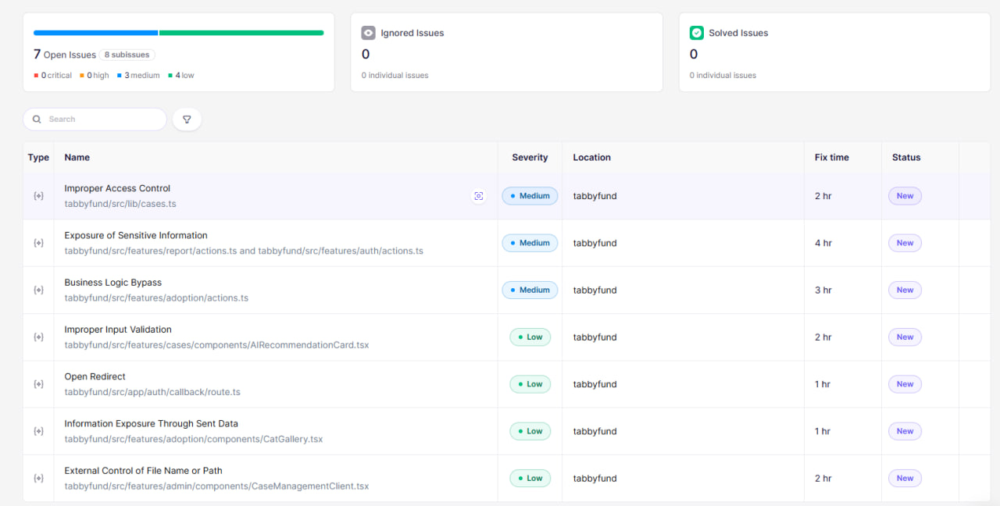
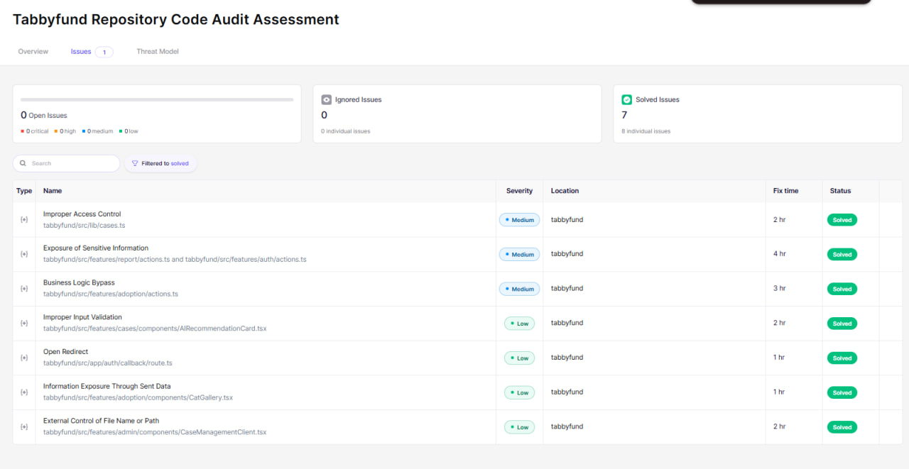

# Security Report — TabbyFund

### Status: ✅ All security issues resolved after retest

---

## 1. Aikido Security Scan

As part of the hackathon submission, TabbyFund was scanned using **Aikido Security** to identify and remediate potential security risks.

The scan performed comprehensive checks across the codebase, evaluating the application for:

- Code security vulnerabilities
- Sensitive data exposure
- Broken access controls
- Business logic bypasses
- Input validation and sanitization issues
- Open redirects
- Unsafe external resource loading

All identified issues were reviewed, fixed manually, pushed to GitHub, and successfully retested.

**Final Retest Result: 100% of reported issues resolved.**

---

## 2. Security Issues Fixed

The following vulnerabilities and security risks were remediated during the security audit:

### Access Control & Data Exposure

- **Remediated adoption medical notes exposure**: Removed `medical_notes` from the generic case details query in `getCaseDetail()`. Adoption medical notes are now only queried and rendered in adoption-specific pages (`/adopt/[id]`), veterinarian portals, and administrator views, preventing leakage of sensitive medical data on the authenticated `/cases/[id]` route.
- **Redacted exact rescue addresses**: Removed the appending of `Location: ...` from newly reported case descriptions. Added read-time regex redaction (`redactLocationFromDescription`) to scrub any inline and whole-line `Location:` patterns from existing legacy descriptions across all public feeds, cards, and detail pages. Exact coordinates are protected by RLS and visible only to assigned responders.

### Auth & Registration

- **Mitigated registration email enumeration**: Modified the registration flow in `registerAction()` so duplicate signup attempts no longer return a visible duplicate-account error. Duplicate attempts now follow the same initial post-registration redirect path as successful signups, and any unauthenticated follow-up navigation is handled by the normal auth guard. This prevents the registration form and server action response from directly revealing whether an email address is already registered.
- **Fixed open redirect risk**: Hardened the Next.js auth callback handler (`/auth/callback`) to validate the `next` redirect parameter. It now strictly allows local relative paths starting with a single `/` and rejects protocol-relative targets starting with double slashes (e.g., `//evil.example`), falling back to a safe route.

### Input Validation & Safety

- **Enforced vet treatment readiness check**: Updated the `adoptCat` action to enforce that `treatment_records.ready_for_adoption` must be `true` before final adoption. This prevents bypassing vet approvals via direct server action calls.
- **Hardened AI reasoning parsing**: Hardened the triage reasoning deserializer (`parseAIReasoning`) and UI badge coloring helpers (`getUrgencyBadgeColor`) to strictly check and normalize the type of incoming triage results. Non-string urgency payloads (e.g., objects) are safely fallback-handled to prevent client-side crashes.
- **Sanitized foster photo URLs**: Added write-time and read-time validators (`sanitizeFosterPhotos` / `isSafePhotoUrl`) to only allow photos uploaded to the trusted Supabase Storage domain (`process.env.NEXT_PUBLIC_SUPABASE_URL`) under the public bucket pathname.
- **Sanitized rescue report photo URLs**: Hardened the report action (`submitRescueReport`) and the admin case management UI (`CaseManagementClient`) to validate that the main case photo comes from the trusted Supabase Storage bucket, falling back to a local mascot placeholder if any untrusted URL is encountered.

---

## 3. Aikido Security Scan Results

Screenshots of the completed Aikido scan and retest results are included below:

- **Initial scan result**
- **Final retest result**

